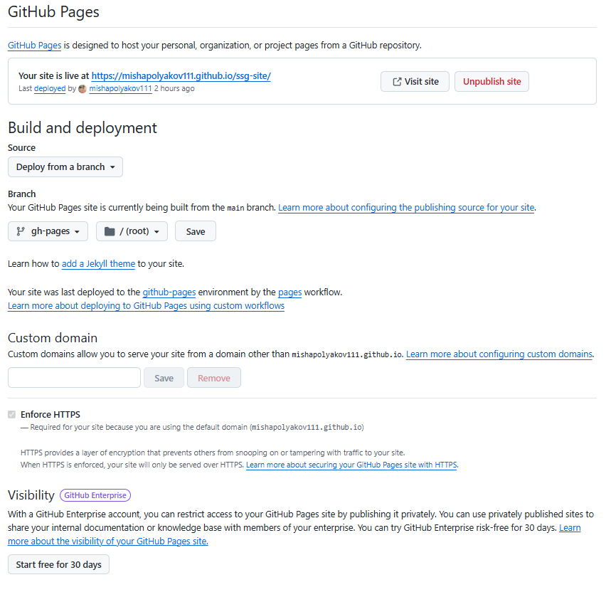
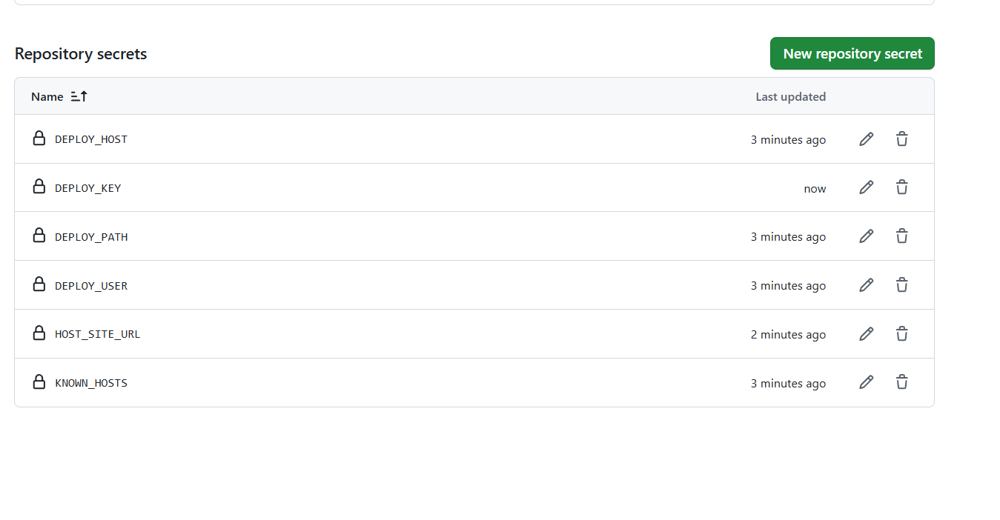
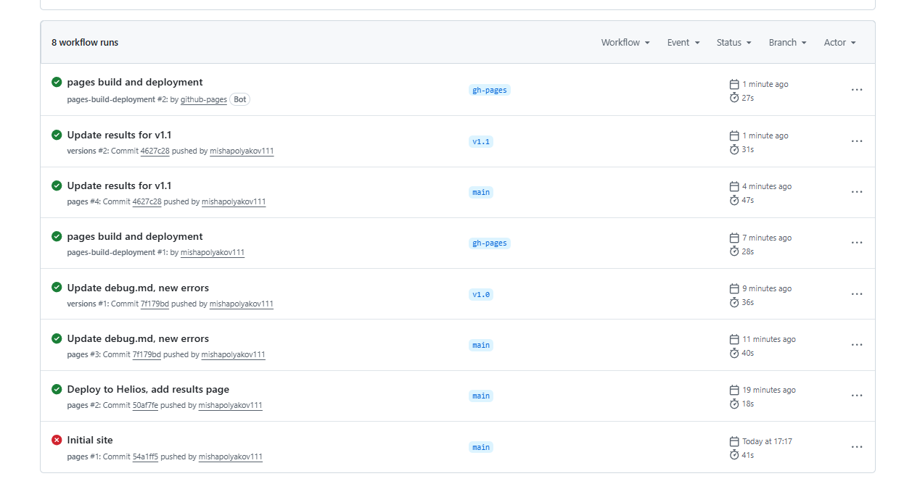
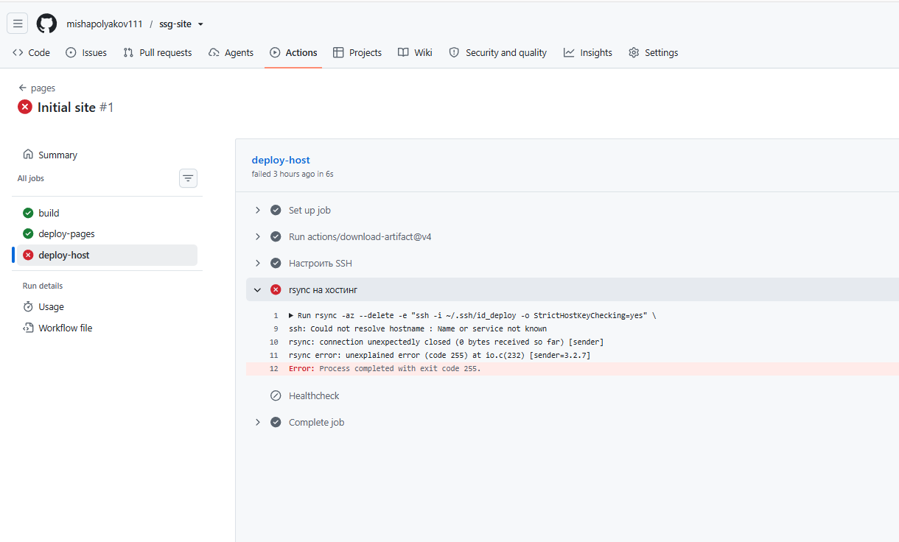
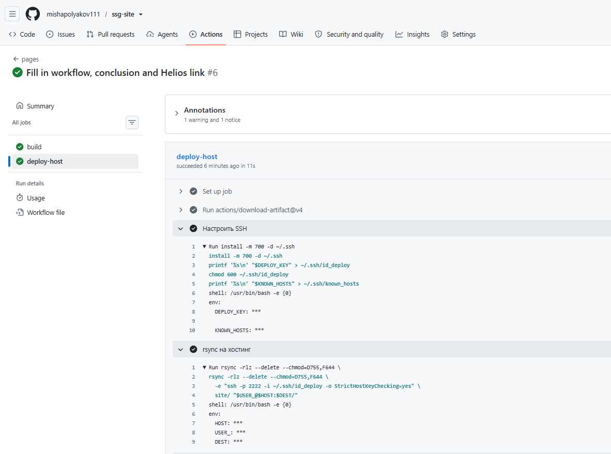
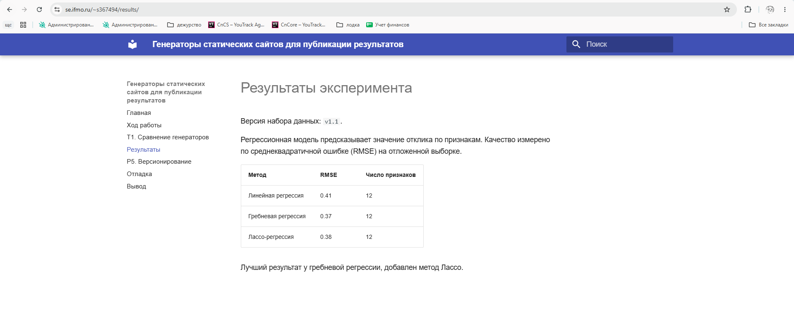

# Ход работы

Краткий перечень шагов 1–14 из задания.

| Шаг | Что сделано | Статус |
|---|---|---|
| 1–3 | Python 3.13, venv, каталог проекта | сделано |
| 4 | `requirements.txt` с точными версиями, `.gitignore` | сделано |
| 5–6 | MkDocs Material, `mkdocs build --strict` | сделано |
| 7–8 | Репозиторий, GitHub Actions, Pages | сделано |
| 9–10 | Helios: доступ по SSH, deploy-ключ, `rsync` в `~/public_html` | сделано |
| 11 | `site_url`, `use_directory_urls` | сайт работает и в корне Pages, и в подкаталоге `/~s367494/` на Helios |
| 12 | Проверка HTTP-кода, поиска, внешних ресурсов | см. ниже |
| 13 | Лицензии: MIT и CC BY 4.0 | сделано |
| 14 | Отладка | см. [Отладка](debug.md) |

## Pages: два подхода

- `peaceiris/actions-gh-pages` пушит собранный сайт в ветку `gh-pages`; нужен токен с правом записи в репозиторий.
- `actions/upload-pages-artifact` + `actions/deploy-pages` публикуют артефакт напрямую, права ограничены `pages: write` и `id-token: write`, ветка с HTML не нужна.

Сначала сайт публиковался вторым способом. Для P5 `mike` сам пишет собранные версии в ветку `gh-pages`, поэтому источник Pages переключён на эту ветку, а job `deploy-pages` из workflow убран: два способа одновременно конфликтуют.

## Пайплайн

Файл `.github/workflows/pages.yml`:

- сборка `mkdocs build --strict` на каждый push и pull request;
- job `deploy-host` только для ветки `main`: `rsync` по SSH на Helios (порт 2222, отдельный deploy-ключ, `StrictHostKeyChecking=yes`) и проверка опубликованного адреса.

Файл `.github/workflows/versions.yml` срабатывает на тег `v*` и публикует версию через `mike`.

Секреты хранятся в настройках репозитория, в самом репозитории их нет:

## Запуски

Длительность запусков по списку выше:

| Запуск | Событие | Время |
|---|---|---|
| Deploy to Helios, add results page (`pages` #2) | push в `main` | 18 с |
| Update debug.md (`pages` #3) | push в `main` | 40 с |
| Update debug.md (`versions` #1) | тег `v1.0` | 36 с |
| Update results for v1.1 (`pages` #4) | push в `main` | 47 с |
| Update results for v1.1 (`versions` #2) | тег `v1.1` | 31 с |

Время — длительность всего запуска, один замер на строку.

## Проваленный запуск

Первый запуск после пуша (`Initial site`, `pages` #1) завершился ошибкой в job `deploy-host`, шаг `rsync на хостинг`. Сборка (`build`) и публикация на Pages в этом запуске прошли.

Разбор лога:

| Строка лога | Что означает |
|---|---|
| `ssh: Could not resolve hostname : Name or service not known` | `ssh` получил пустое имя хоста |
| `rsync: connection unexpectedly closed (0 bytes received so far)` | `rsync` не смог открыть соединение |
| `rsync error: unexplained error (code 255)` | код 255 возвращает `ssh` при ошибке подключения |
| `Error: Process completed with exit code 255.` | шаг завершился ошибкой, следующий шаг (Healthcheck) пропущен |

Причина и исправление описаны в разделе [Отладка](debug.md), ошибка 5.

Лог job `deploy-host`: значения секретов заменены на `***`, ключ хоста проверяется (`StrictHostKeyChecking=yes`).

## Проверка результата (шаг 12)

- Код ответа Helios: `curl -I https://se.ifmo.ru/~s367494/` вернул `200 OK`. Адрес по `http` отвечает `302` на `https`.
- Сайт на Helios открывается в подкаталоге, стили и навигация работают:

  

- В пайплайне после `rsync` выполняется healthcheck: запрос адреса, проверка кода 200 и наличия контрольной строки в HTML.
- Поиск работает на опубликованном сайте, проверка на русских запросах — на странице [P5](p5.md).
- Внешние ресурсы: на странице Pages нет подключаемых скриптов, стилей и шрифтов с чужих доменов. Шрифты отключены в `mkdocs.yml`, MathJax лежит в `docs/javascripts/`.
